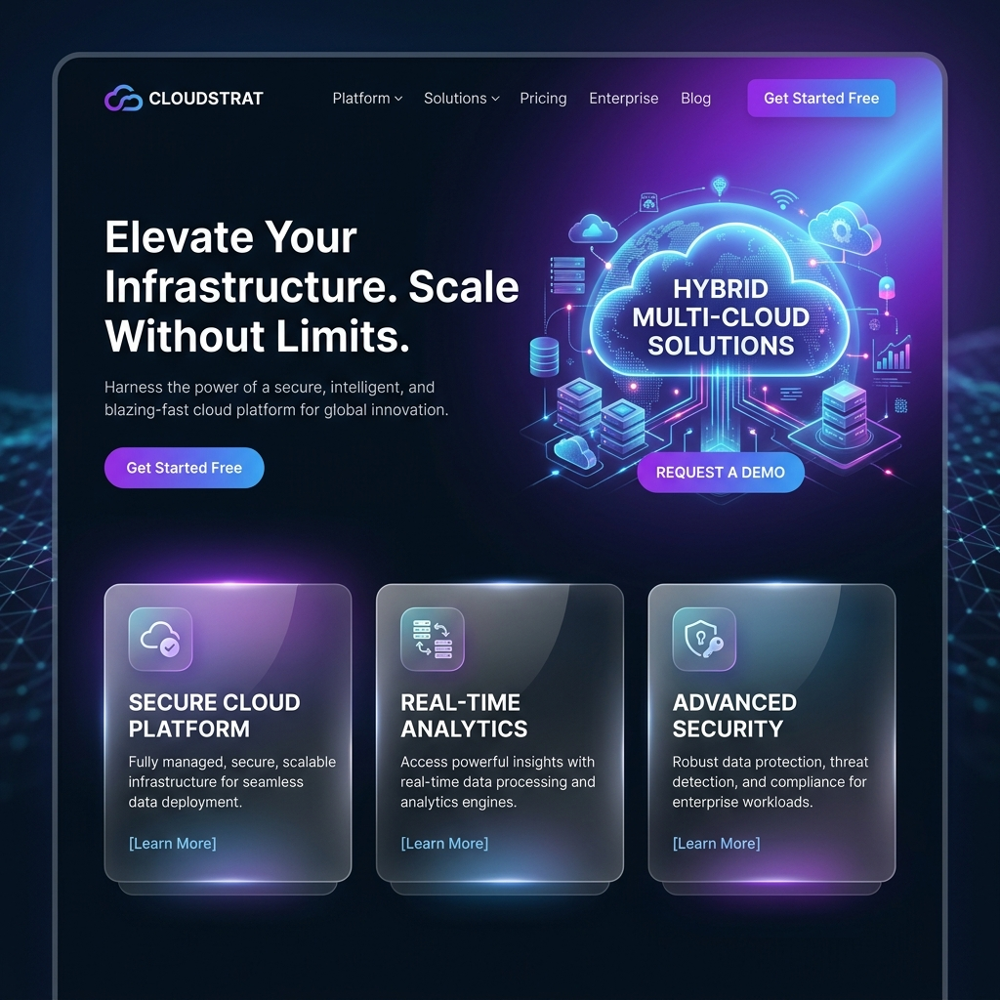
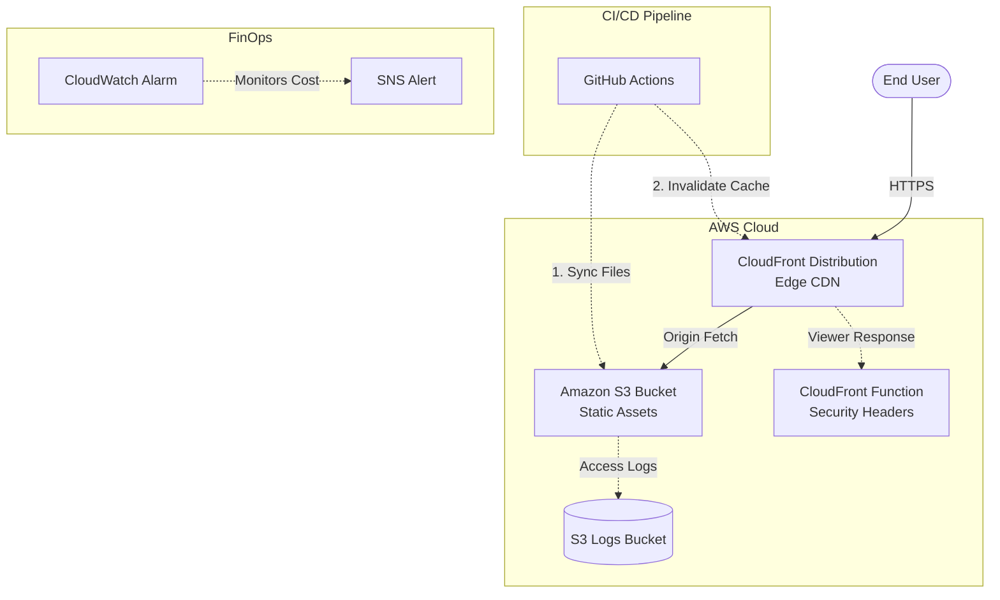

<div align="center">
  
  <br><br>

  <h1>AWS Serverless Static Hosting Platform</h1>
  
  <p><b>A highly available, production-grade cloud architecture for static assets.</b></p>

  <div>
    
    
    
    
  </div>
</div>

<br>

## 📌 Executive Summary
This project represents a fully realized, Senior-level cloud architecture designed to host static frontend applications with maximum performance, zero-server maintenance, and strict security compliance. 

Moving beyond standard S3 hosting, this platform leverages a global Content Delivery Network (CDN) for edge caching, Terraform for Infrastructure as Code (IaC), Edge Compute for injecting military-grade security headers, and an automated continuous deployment pipeline.

## 🏗️ Architecture Deep Dive



## 🚀 Core Technologies
- **Storage:** Amazon S3 (Provides 99.999999999% data durability with highly available object storage).
- **Edge Delivery:** Amazon CloudFront (Caches assets globally, reducing Time to First Byte to single-digit milliseconds).
- **Encryption:** AWS Certificate Manager (ACM) (Enforces strict SSL/TLS encryption for data in transit).
- **Infrastructure as Code:** Terraform (Provides a declarative, idempotent configuration of all cloud resources).

## 🛡️ Advanced Edge Security
Instead of running a traditional web server to handle HTTP headers, this architecture utilizes **CloudFront Functions** (Serverless Edge Compute). 

A custom JavaScript function intercepts every outbound response at the edge node closest to the user and dynamically injects:
- `Strict-Transport-Security` (HSTS)
- `X-Content-Type-Options` (nosniff)
- `X-Frame-Options` (DENY)
- `X-XSS-Protection` (1; mode=block)

## 📈 FinOps & Cost Strategy
Cost optimization is built directly into the architecture:
- **S3 Lifecycle Rules:** Automatically purges server access logs after 30 days to prevent infinite storage bloat.
- **CloudWatch Billing Alarms:** Programmatically monitors `EstimatedCharges` in `us-east-1` and triggers an SNS alert if costs exceed $1.00.
- **CloudFront Pricing Class:** Locked to `PriceClass_100` to maximize AWS Free Tier utilization.

## ⚙️ CI/CD Pipeline Lifecycle
The deployment process is 100% automated using **GitHub Actions**:
1. **Trigger:** Developer pushes code to the `main` branch.
2. **Authenticate:** Action securely assumes AWS credentials using GitHub Secrets (safeguarding the repository from leaked keys).
3. **Sync:** Runs `aws s3 sync --delete` to instantly update the S3 origin.
4. **Invalidate:** Triggers `aws cloudfront create-invalidation` to immediately purge the global edge cache.

## 🧑‍💻 How to Deploy (IaC)

Deploying the infrastructure from scratch takes less than 3 minutes.

```bash
# 1. Initialize Terraform
cd terraform
terraform init

# 2. Preview the Infrastructure
terraform plan

# 3. Deploy to AWS
terraform apply -auto-approve
```

## 📖 Key Learnings
Building this platform solidified core cloud engineering principles including the transition from "ClickOps" (AWS Console) to automated scripts (Python/Boto3), and finally to declarative Infrastructure as Code (Terraform). It demonstrates a complete understanding of the modern DevOps lifecycle.
