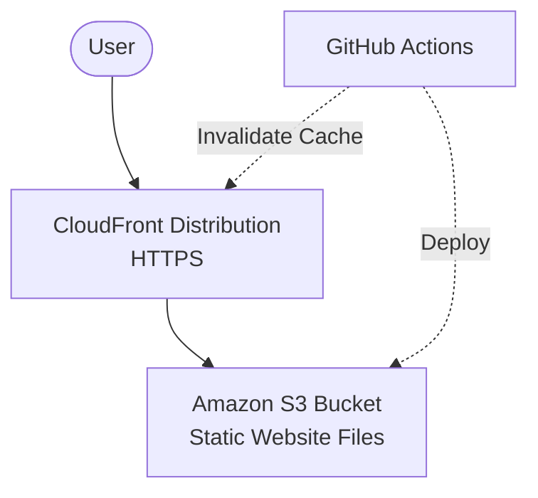

# AWS Static Website Platform — Production-Grade Hosting & CI/CD

A complete AWS production-style static website deployment platform featuring secure HTTPS delivery, CDN acceleration, infrastructure automation, and continuous deployment.

## Project Overview
Production-grade static website hosting on AWS using S3, CloudFront, ACM, boto3 automation, lifecycle policies, and GitHub Actions CI/CD.

## Architecture Diagram

