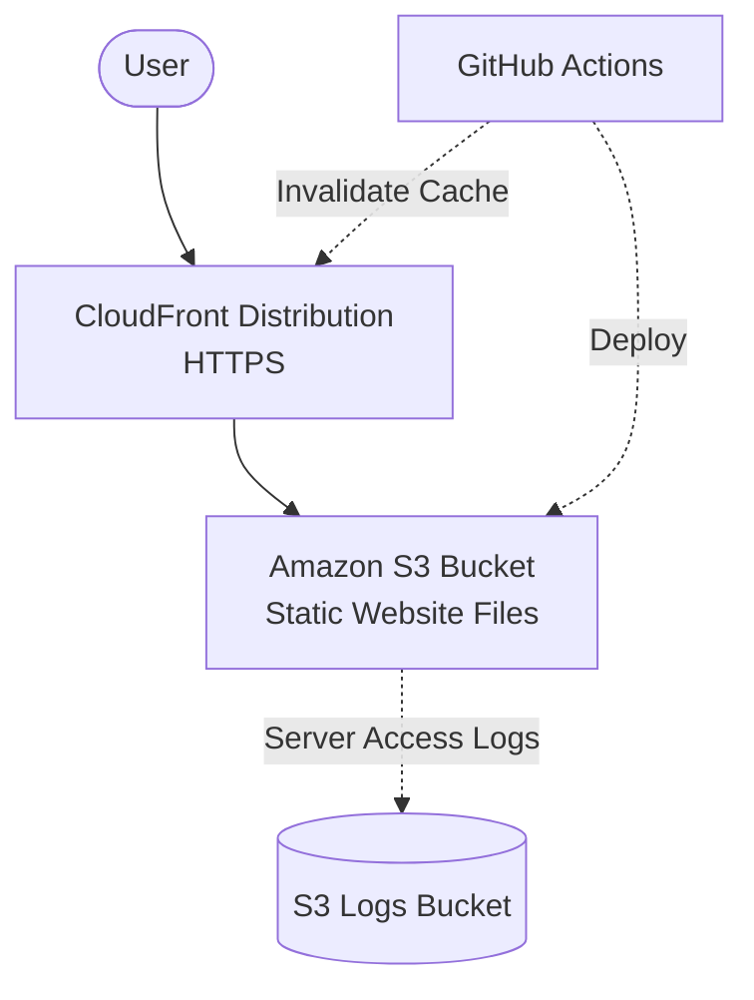

# AWS Static Website Platform — Production-Grade Hosting & CI/CD


A complete AWS production-style static website deployment platform featuring secure HTTPS delivery, CDN acceleration, infrastructure automation, and continuous deployment.

## 📌 Project Overview
This project demonstrates the ability to engineer a serverless, highly available, and cost-optimized static website hosting solution on AWS. Moving beyond basic S3 hosting, this architecture incorporates Amazon CloudFront for edge caching, AWS Certificate Manager for SSL/TLS, and automated CI/CD pipelines via GitHub Actions.


## 🏗️ Architecture Diagram



## 🛠️ AWS Services Utilized
* **Amazon S3**: Utilized for highly durable, serverless static file storage.
* **Amazon CloudFront**: Configured as a global Content Delivery Network (CDN) to reduce latency and cache assets at edge locations.
* **AWS Certificate Manager (ACM)**: Used to provision and attach SSL/TLS certificates, enforcing strict HTTPS.
* **AWS IAM**: Configured least-privilege access policies for GitHub Actions to deploy to S3 and invalidate CloudFront caches.
* **AWS SDK (boto3)**: Leveraged Python scripts to automate infrastructure provisioning and cache invalidations, adhering to Infrastructure as Code (IaC) philosophies.

## ⚙️ CI/CD Pipeline
The deployment lifecycle is fully automated using **GitHub Actions**. Upon any push to the `main` branch, the pipeline:
1. Provisions temporary AWS credentials.
2. Synchronizes the local `website/` directory with the S3 bucket using `aws s3 sync`.
3. Issues an `aws cloudfront create-invalidation` command to instantly purge the edge cache, ensuring users immediately receive the latest updates.

## 📖 Lessons Learned & Best Practices
* **Cost Optimization**: Implemented an S3 Lifecycle Rule to automatically expire server access logs after 30 days, ensuring zero long-term storage bloat.
* **Security Posture**: Safeguarded CI/CD credentials using GitHub Secrets and utilized `PriceClass_100` in CloudFront to maximize free-tier benefits.
* **Automation First**: Migrated from manual AWS CLI deployments to Python `boto3` automation to ensure repeatable, idempotent infrastructure deployments.

## 🚀 How to Run Locally

```bash
# Clone the repository
git clone https://github.com/your-username/aws-static-website-platform.git

# Install dependencies for automation scripts
pip install boto3

# Deploy Infrastructure
python scripts/create_s3_static_site.py --bucket your-unique-bucket-name

# Invalidate Cache
python scripts/invalidate_cloudfront.py --distribution-id YOUR_DIST_ID
```
